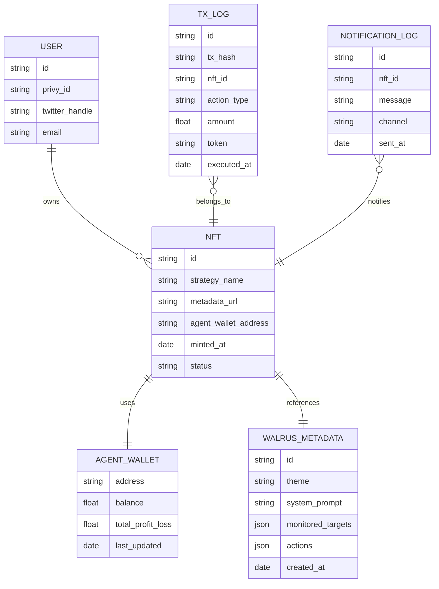

Here is the **Entity-Relationship Diagram (ERD)** for **ConvictionFi**, expressed in `Mermaid` syntax. This structure assumes a hybrid architecture using both Web2 (Firebase) and Web3 components:

---

## Overview:

- `USER`: User information managed via Firebase, authenticated through Privy login
- `NFT`: Ideology-driven DeFAI token minted by the user
- `AGENT_WALLET`: Smart contract wallet associated with each NFT (on-chain)
- `WALRUS_METADATA`: AI configuration JSON stored in Walrus decentralized storage
- `TX_LOG`: Trade execution log by the agent (also persisted off-chain)
- `NOTIFICATION_LOG`: Notification records (via Twitter bot or Web Push)

---

This ER diagram also serves as a foundation for backend DB schema design tailored to Firebase. If needed, it can be converted into a diagram format compatible with tools like dbdiagram.io. Would you like to proceed with that?
