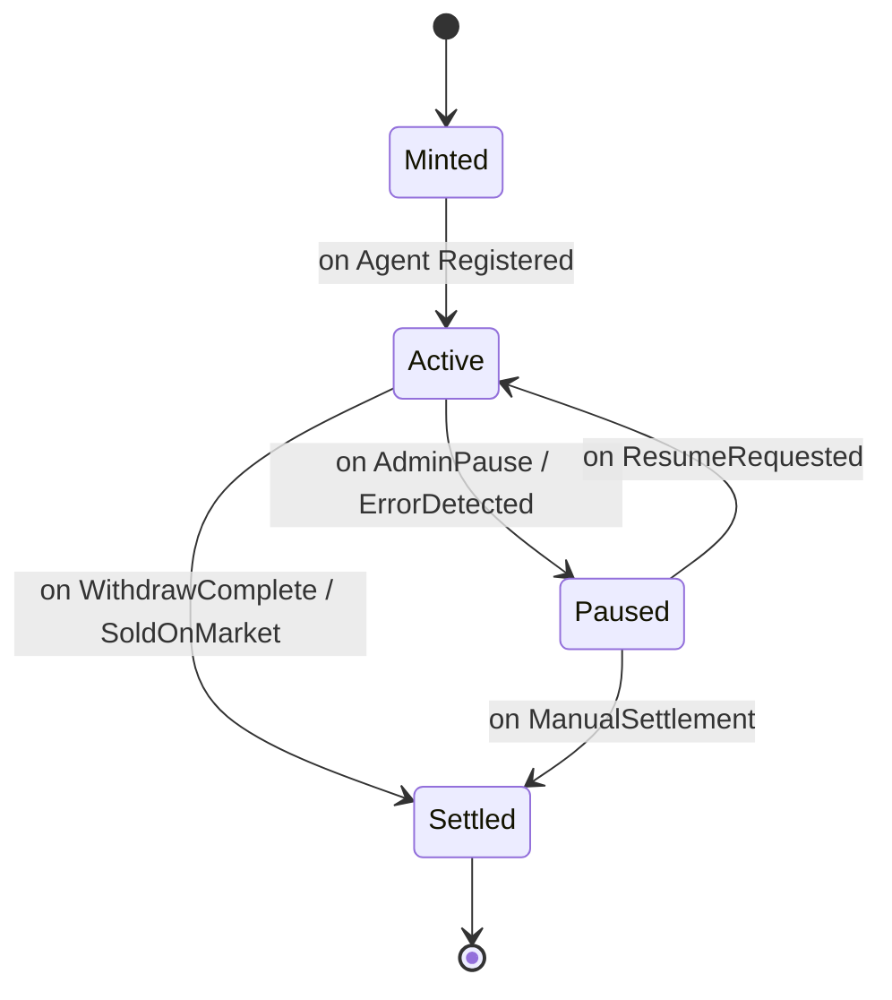

# Smart Contracts 設計

ConvictionFi の設計に基づくと、**MVP 段階で必要なスマートコントラクトは最低でも 3〜4 種類**になります。以下に、目的別に分類した一覧と、それぞれの役割を整理します：

---

## ✅ 必要なスマートコントラクト一覧（MVP 想定）

### ① **NFT Mint & Registry Contract**

- **目的**：思想・戦略 NFT の Mint と管理
- **主な責務**：

  - NFT の発行（Move module で mint 関数）
  - `strategy_name`, `metadata_url`, `agent_wallet_address` の記録
  - 所有者管理（transfer 可能 or 非 transfer 設計に応じて）

- **設計の要点**：

  - Mint 時にエージェントウォレット生成と紐づけ
  - metadata_url は Walrus JSON を参照

---

### ② **Agent Wallet Contract**

- **目的**：各 NFT に紐づく資産の分離管理
- **主な責務**：

  - `deposit`：Mint 時の入金
  - `execute_tx`：Agent からの投資 Tx 実行（Sui Agent Kit 経由）
  - `withdraw`：引き出し処理（lock 期間付き or 無効化）

- **設計の要点**：

  - ウォレットごとに NFT ID と紐づける
  - Agent 署名のみ Tx 可能なアクセス制御
  - `lock_until`の timestamp や`withdraw_enabled: bool`のフラグ設計が必要

---

### ③ **Factory Contract（optional）**

- **目的**：NFT Mint ＋ Agent Wallet 作成を一括で行う
- **主な責務**：

  - `mint_with_wallet()`：NFT + Agent Wallet を一括発行
  - エージェントアドレスを自動生成し、NFT に埋め込む

- **設計の要点**：

  - UX を簡潔にする（Mint = 完了の一歩化）
  - テストネット用にあると便利

---

### ④ **Execution Router Contract（optional, Sui Agent Kit 向け）**

- **目的**：Agent から送られた Tx の処理を中継
- **主な責務**：

  - 外部 Tx を検証してウォレットに転送
  - 複数の Agent Wallet に共通ロジックを持たせる

- **設計の要点**：

  - Sui Agent Kit で Tx を実行する場合、Tx データ検証が必要
  - Agent Wallet に直接実行権限を持たせるより安全

---

## 🧠 補足設計（MVP 以降に検討）

| コントラクト             | 目的                         | コメント                             |
| ------------------------ | ---------------------------- | ------------------------------------ |
| **Fee Vault Contract**   | ConvictionFi 運営の Fee 徴収 | 売買・運用収益に応じた料率徴収       |
| **Marketplace Contract** | 二次流通専用設計             | NFT の思想マーケット用に独立設計も可 |
| **Template Registry**    | 投資戦略テンプレの登録・利用 | フォークやバージョン管理機能との連携 |

---

## ✅ 推奨 MVP 構成（初期導入）

| 種類                | 実装有無 | コメント                               |
| ------------------- | -------- | -------------------------------------- |
| NFT Mint & Registry | ✅ 必須  | NFT を思想トークンとして成立させる中核 |
| Agent Wallet        | ✅ 必須  | 投資資産を分離管理するために必要       |
| Factory             | ⭕ 任意  | UX 向上・開発効率化のためにあると便利  |
| Execution Router    | ⭕ 任意  | セキュアな Tx 中継設計を取るなら推奨   |

---

---

以下に、ConvictionFi の MVP で必要なスマートコントラクト 3 種について、**関数一覧と引数の型定義（Move ベース想定）**を整理しました。

## ✅ ① `ConvictionNftContract`（NFT Mint & Registry）

### 📄 主要機能

思想・戦略 NFT の Mint と記録

### 🧩 関数定義

```move
public entry fun mint_nft(
    account: &signer,
    strategy_name: vector<u8>,
    metadata_url: vector<u8>,
    agent_wallet_address: address
): NFT
```

| 引数                   | 型           | 説明                               |
| ---------------------- | ------------ | ---------------------------------- |
| `account`              | `&signer`    | NFT をミントするユーザー           |
| `strategy_name`        | `vector<u8>` | 表示用戦略名                       |
| `metadata_url`         | `vector<u8>` | Walrus 上の JSON URL               |
| `agent_wallet_address` | `address`    | 自動生成されたウォレットのアドレス |

---

## ✅ ② `AgentWalletContract`（NFT ごとの資産管理）

### 📄 主要機能

資産の保持と Agent による実行、出金制御

### 🧩 関数定義

```move
public entry fun deposit(
    wallet: &mut AgentWallet,
    token: Coin<T>,
    from: &signer
)
```

```move
public entry fun execute_transaction(
    wallet: &mut AgentWallet,
    tx_data: vector<u8>,
    agent_signer: &signer
)
```

```move
public entry fun withdraw(
    wallet: &mut AgentWallet,
    to: address,
    amount: u64,
    caller: &signer
)
```

```move
public fun is_withdrawable(
    wallet: &AgentWallet,
    current_time: u64
): bool
```

| 関数                  | 説明                                      |
| --------------------- | ----------------------------------------- |
| `deposit`             | Mint 時または入金時の資金受け入れ         |
| `execute_transaction` | Agent による任意トレード実行（Swap など） |
| `withdraw`            | 引き出し処理（ロック期間考慮）            |
| `is_withdrawable`     | 現在時刻と lock_until を比較              |

---

## ✅ ③ `MintFactoryContract`（Factory：NFT+Wallet 生成）

### 📄 主要機能

UX 簡略化。Mint と Wallet 生成を同時に行う。

### 🧩 関数定義

```move
public entry fun mint_with_wallet(
    account: &signer,
    strategy_name: vector<u8>,
    metadata_url: vector<u8>
): (NFT, address)
```

| 引数            | 型           | 説明             |
| --------------- | ------------ | ---------------- |
| `account`       | `&signer`    | 呼び出しユーザー |
| `strategy_name` | `vector<u8>` | 戦略名           |
| `metadata_url`  | `vector<u8>` | Walrus の URL    |

| 戻り値    | 型      | 説明                                   |
| --------- | ------- | -------------------------------------- |
| `NFT`     | struct  | 発行された NFT                         |
| `address` | address | 自動生成された Agent Wallet のアドレス |

---

## 🔒 セキュリティ設計補足（各コントラクト共通）

| 項目              | 実装内容（Move）                                            |
| ----------------- | ----------------------------------------------------------- |
| **権限制御**      | `only_agent_signer`のようなカスタム assert 定義             |
| **withdraw 制御** | `lock_until: u64` を `AgentWallet` struct に保持            |
| **再入禁止**      | `execute_transaction` 内部に `in_progress` フラグ設計も可能 |

---

以下に、**ConvictionFi における NFT のステートマシン設計**を示します。これは MVP において NFT のライフサイクルを安全かつ明確に管理するための構造であり、**各ステータスで許可されるアクション**や**状態遷移の条件**を規定します。

---

## 🔄 ConvictionFi NFT ステートマシン



---

## 🧩 各状態の定義

| 状態      | 説明                                         | 許可されるアクション                |
| --------- | -------------------------------------------- | ----------------------------------- |
| `Minted`  | NFT が Mint された直後。エージェント未設定。 | Wallet 生成、Agent 登録             |
| `Active`  | エージェントが登録され、自律運用中           | トレード実行、通知送信、成績記録    |
| `Paused`  | エージェントの自律運用が一時停止             | 処理中断（Tx 不可）、監査、手動制御 |
| `Settled` | 運用終了。NFT が売却または引き出し済み       | 二次流通、記録閲覧のみ（実行不可）  |

---

## 🛠 状態遷移の条件

| 遷移元 → 遷移先              | 条件                                           |
| ---------------------------- | ---------------------------------------------- |
| `Minted → Active`            | Agent Wallet が正常に生成＆登録されたとき      |
| `Active → Paused`            | Bot エラー / 管理者操作 / 投資戦略一時停止要求 |
| `Paused → Active`            | ユーザーまたは Bot が Resume 要求を送信        |
| `Active or Paused → Settled` | 出金完了 or NFT がマーケットで売却されたとき   |

---

## 🧠 Move での設計イメージ

```move
enum NFTStatus {
    Minted,
    Active,
    Paused,
    Settled
}

struct ConvictionNFT has key {
    id: u64,
    status: NFTStatus,
    strategy_name: vector<u8>,
    metadata_url: vector<u8>,
    agent_wallet: address,
}
```

---

### ✅ 状態チェックのサンプルロジック（Move）

```move
public fun ensure_active(nft: &ConvictionNFT) {
    assert!(nft.status == NFTStatus::Active, E_NOT_ACTIVE);
}
```

---

## 🔒 セキュリティ/UX 上のメリット

- **安全性**：Paused 状態で Tx 実行を防止できる（不正・不安定時対応）
- **透明性**：Settled 状態で NFT 売買は可能だが、投資はされないと明示
- **柔軟性**：Bot のトラブルや停止要求に即応できる
- **UX 適合**：ダッシュボードでステータスごとに UI を変化させることが容易

---

以下に、ConvictionFi における**NFT の状態遷移ログ（イベント）設計**を整理します。目的は、**ステートマシンの変更履歴をオンチェーンで追跡可能にし、UI 通知・監査・Bot 連携を可能にすること**です。

---

## ✅ 設計方針

- すべての状態遷移に `emit<Event>` を実行
- イベントは `event::EventHandle<T>` にバインドしてインデックス化
- `NFT ID` と `遷移後ステータス` を保持
- `Reason` や `Tx Hash` などの補足情報もログに残す

---

## 🧩 イベント定義（Move）

```move
module convictionfi::nft_events {

    use sui::object::{ID};
    use sui::event;

    /// 状態遷移ログイベント
    struct NFTStateChangedEvent has copy, drop, store {
        nft_id: ID,
        from_status: u8,
        to_status: u8,
        reason: vector<u8>,
        timestamp: u64,
    }

    struct NFTEventStore has key {
        event_handle: event::EventHandle<NFTStateChangedEvent>,
    }

    public fun emit_nft_state_changed(
        store: &mut NFTEventStore,
        nft_id: ID,
        from_status: u8,
        to_status: u8,
        reason: vector<u8>,
        timestamp: u64
    ) {
        let event = NFTStateChangedEvent {
            nft_id,
            from_status,
            to_status,
            reason,
            timestamp,
        };
        event::emit(&mut store.event_handle, event);
    }
}
```

---

## 📋 状態番号の定義（例）

```move
enum NFTStatus {
    Minted = 0,
    Active = 1,
    Paused = 2,
    Settled = 3
}
```

---

## 🧠 イベント活用ユースケース

| 活用箇所                 | 説明                                                               |
| ------------------------ | ------------------------------------------------------------------ |
| **オンチェーンログ監査** | UI や Bot が過去のイベント履歴をスキャンして状態変化を可視化       |
| **Twitter Bot 連携**     | `Paused → Active` を検出して「エージェント復帰しました」と通知可能 |
| **Analytics 可視化**     | 状態遷移の頻度を可視化して UX 改善の指標に                         |
| **エラー対応**           | `reason` フィールドに `"oracle_fetch_fail"` などの理由を記録可能   |

---

## 🔍 インデックス例（オフチェーンで使う）

| 項目                        | 内容          |
| --------------------------- | ------------- |
| `nft_id`                    | 対象の NFT ID |
| `from_status` / `to_status` | 数値（0〜3）  |
| `reason`                    | UTF-8 文字列  |
| `timestamp`                 | UNIX 時刻     |

---

以下に、ConvictionFi の **イベント収集 Bot 設計** を提示します。目的は、**Sui 上で emit された NFT の状態遷移イベント（`NFTStateChangedEvent`）を検知し、フロントエンドや通知システムへ中継**することです。

---

## 🧭 1. 目的と要件

### 🔹 主な目的

- NFT の状態（Minted → Active → Paused → Settled など）の遷移を**リアルタイム検知**
- Bot が Slack/Twitter/Firebase/Discord などに**通知**
- ダッシュボードへの**履歴記録**に使えるデータを生成

### 🔹 要件

- **Sui のイベントインデックスを監視**
- フィルタリング条件：`module == convictionfi::nft_events` + `event_type == NFTStateChangedEvent`
- 信頼性：Bot 停止中のイベントは後から再取得可能
- 書き込み先：Firebase Firestore / Discord Webhook / Twitter Bot など

---

## 🏗️ 2. アーキテクチャ構成図

```text
[Sui Event Indexer or Full Node]
        ↓
 [Event Listener Bot (Node.js / Python)]
        ↓
 ┌────────────┬─────────────┬─────────────┐
 │ Firebase   │ Discord     │ Twitter     │
 │ Firestore  │ Webhook     │ Notifier    │
 └────────────┴─────────────┴─────────────┘
```

---

## ⚙️ 3. Bot の構成（Node.js or Python）

### 📦 必要ライブラリ（例：Node.js）

```bash
npm install @mysten/sui.js firebase-admin axios dotenv
```

### 🧠 基本処理フロー（擬似コード）

```ts
while (true) {
  const events = await suiClient.getEvents({
    filter: {
      MoveModule: {
        package: "0xYourPackage",
        module: "nft_events"
      }
    },
    startTime: lastCheckedTimestamp,
  });

  for (const e of events) {
    const { nft_id, from_status, to_status, reason, timestamp } = e.parsedJson;

    // Firebaseへ保存
    await firestore.save("nft_logs", { nft_id, from_status, to_status, reason, timestamp });

    // Discord通知
    if (to_status == 1) postToDiscord(`🎯 NFT ${nft_id} activated.`);
    if (to_status == 2) postToDiscord(`⏸️ NFT ${nft_id} paused. Reason: ${reason}`);

    // Twitter通知（省略可）
    // await twitterBot.replyToUser(nft_id, `Your agent is now ${statusToText(to_status)}`);
  }

  wait(10 seconds);
}
```

---

## 🧩 4. Firestore 保存構造（例）

```json
{
  "nft_id": "0xabc123",
  "from_status": 0,
  "to_status": 1,
  "reason": "agent_initialized",
  "timestamp": 1716800000
}
```

---

## 🔐 5. 信頼性 & 拡張性設計

| 要素                 | 設計内容                                               |
| -------------------- | ------------------------------------------------------ |
| **状態保持**         | 最終取得イベントの timestamp を `.json` に保存しておく |
| **Bot の再起動耐性** | timestamp ベースで未取得イベントを再取得可能           |
| **再通知防止**       | Firestore で重複 ID を確認（doc.id = tx_hash など）    |
| **通知拡張**         | LINE 通知 / Telegram 通知など Webhook で追加可能       |
