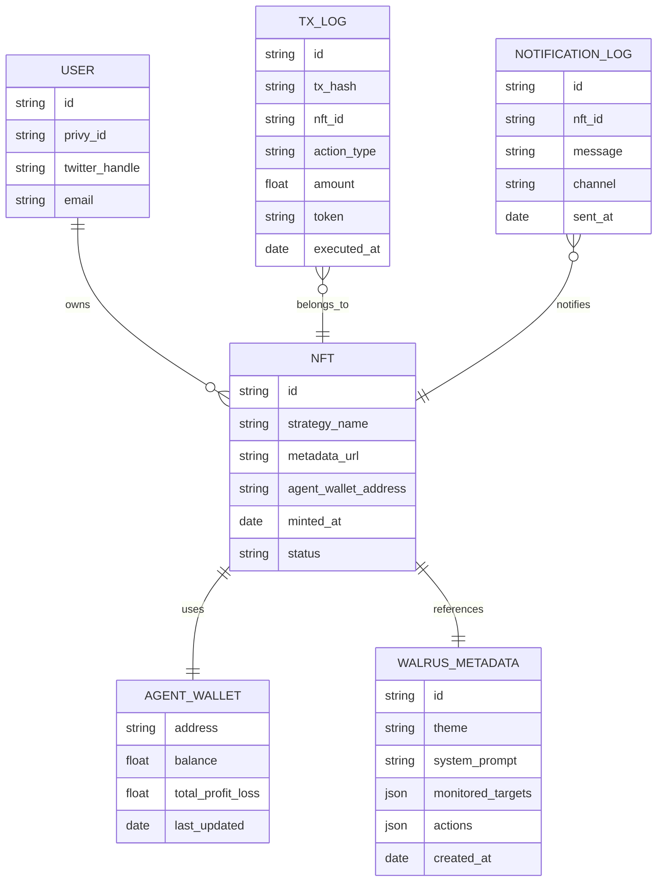

以下は、ConvictionFi の基本的なデータ構造を表現した **ER 図（Entity-Relationship Diagram）** を `Mermaid` 記法で記述したものです。これは Web2（Firebase）＋ Web3 構成を念頭に置いています：

---

## 概要：

- `USER`: Privy ログインに基づくユーザー情報（Firebase で管理）
- `NFT`: ユーザーが Mint した思想ベースの DeFAI トークン
- `AGENT_WALLET`: NFT に紐づくスマートコントラクトウォレット（オンチェーン）
- `WALRUS_METADATA`: Walrus に格納された AI 設定 JSON
- `TX_LOG`: エージェントによる取引履歴（オフチェーンでも保持）
- `NOTIFICATION_LOG`: 通知記録（Twitter Bot または Web Push）
